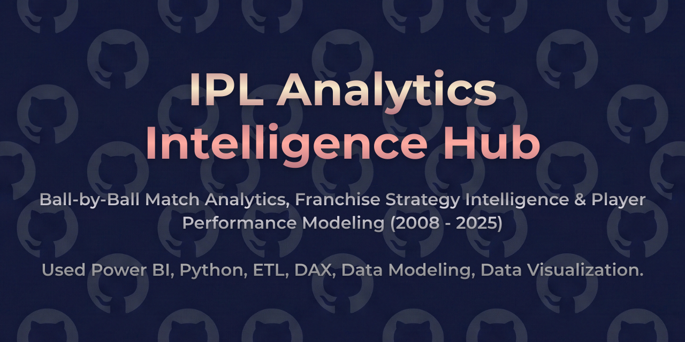
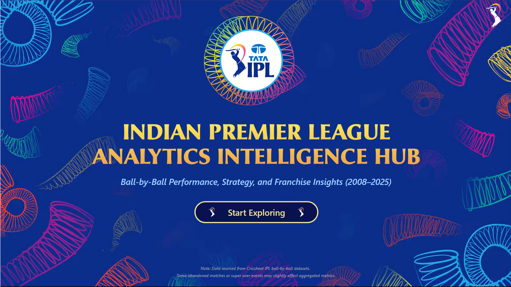
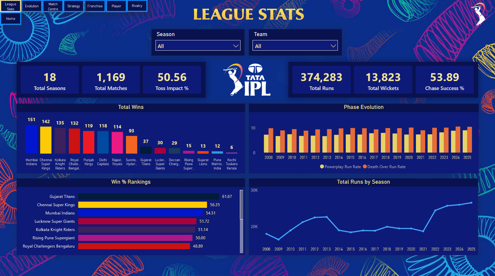
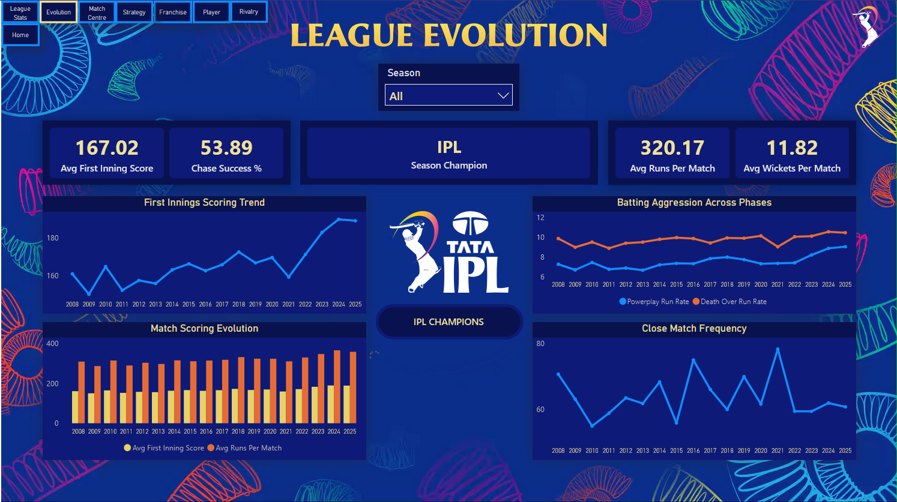
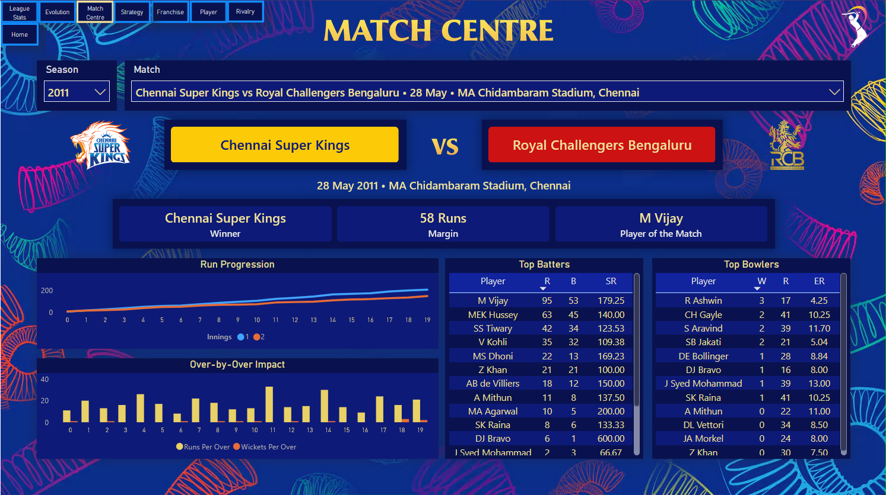
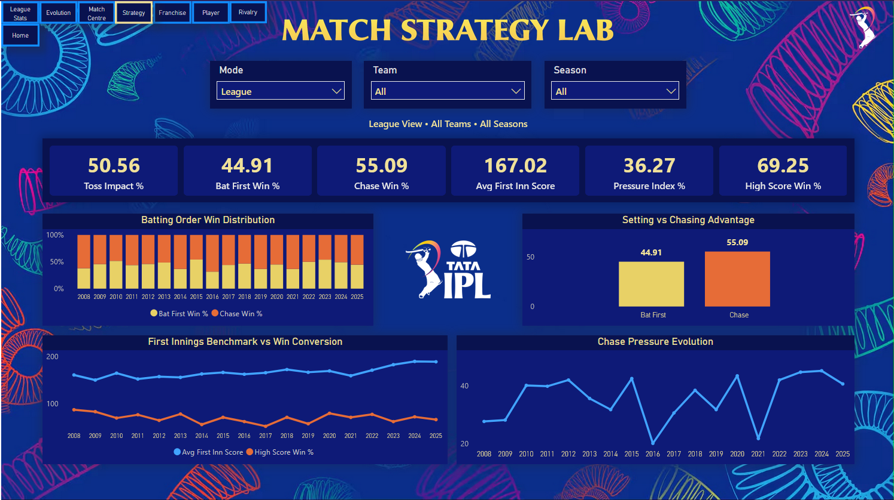
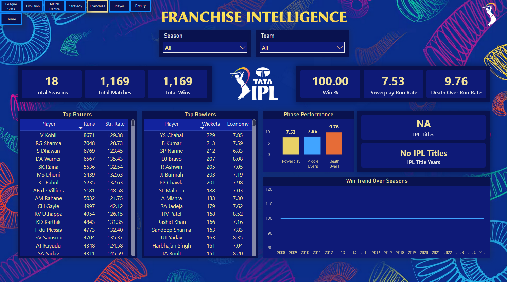
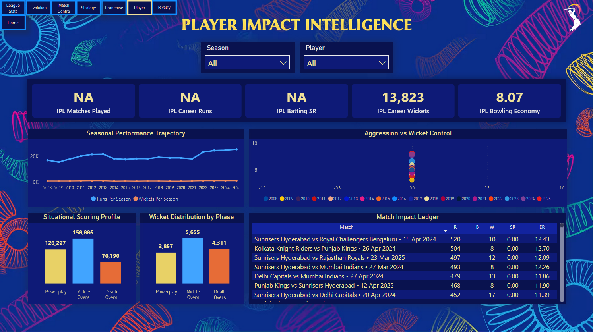
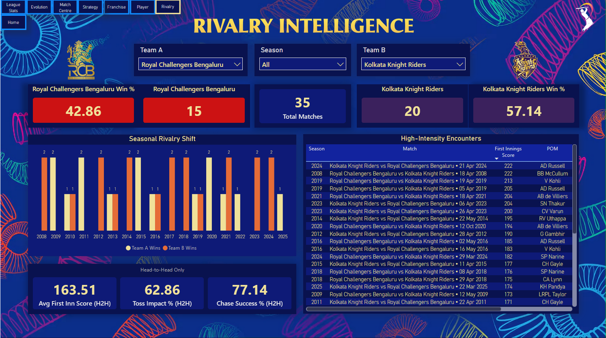

<p align="center">
  
</p>

# 🏏 IPL Analytics Intelligence Hub

### End-to-End Cricket Intelligence Platform (Power BI)

> Ball-by-Ball Match Analytics, Franchise Strategy Intelligence & Player Performance Modeling (2008 - 2025)  
> A comprehensive analytical system built using historical IPL match data.

## 📌 Project Overview

**IPL Analytics Intelligence Hub** is an advanced Power BI analytics platform designed to analyze the Indian Premier League using **ball-by-ball match data**.

The project processes **1,100+ IPL match JSON files** sourced from Cricsheet and transforms them into a structured analytics environment using a custom ETL pipeline.

The dashboard integrates multiple analytical perspectives including:

- League evolution over time
- Match-level intelligence
- Strategic match dynamics
- Franchise success patterns
- Player performance analytics
- Head-to-head rivalries

The goal of this project is to transform raw cricket match data into **interactive strategic insights and analytical storytelling**.

## 📷 Dashboard Preview

### 🏠 Home


### 📊 League Stats


### 📈 League Evolution


### 🏏 Match Centre


### 🧠 Match Strategy Lab


### 🏆 Franchise Intelligence


### 👤 Player Intelligence


### ⚔️ Rivalry Intelligence


## 🎯 Problem Statement

Modern cricket analytics relies heavily on granular event-level data.

However, raw match records are difficult to interpret without structured analytics systems.

This project addresses several analytical questions:

- How have IPL scoring patterns evolved across seasons?
- What strategic factors influence match outcomes?
- How do franchises perform across different phases of the game?
- Which players create the most impact in specific match contexts?
- Which rivalries define IPL competitiveness?
- How do tactical decisions such as toss outcomes influence match results?

The dashboard transforms complex match data into **interactive analytical insights for cricket strategy and performance evaluation**.

## 📊 Dashboard Structure

### 🏠 Home – Project Overview  
Provides a high-level introduction to the analytics platform and navigation to the various analytical modules.

### 📊 League Stats – Macro IPL Analysis  

League-level insights including:

- Total matches played
- Total runs and wickets
- Season-wise scoring trends
- Historical IPL evolution

This module provides a **macro view of the IPL ecosystem**.

### 📈 League Evolution – Historical IPL Trends  

Analyzes how the IPL has evolved across seasons:

- Scoring patterns
- Match outcome distributions
- Strategic shifts in gameplay
- Long-term league trends

This module reveals **the evolution of T20 cricket strategy over time**.

### 🏏 Match Centre – Individual Match Intelligence  

Detailed match analysis including:

- Match scorecards
- Run progression charts
- Innings comparisons
- Player of the match

Designed to replicate the **analytical depth of professional match dashboards**.

### 🧠 Match Strategy Lab – Tactical Match Insights  

Focuses on match strategy patterns including:

- Toss impact analysis
- Bat-first vs chase success rates
- Phase-wise scoring efficiency
- Pressure scenario outcomes

This module provides insights into **strategic decision-making in T20 cricket**.

### 🏆 Franchise Intelligence – Team Performance Analytics  

Analyzes franchise performance across IPL seasons:

- Total wins
- Win percentage
- Championship titles
- Phase-wise scoring patterns
- Strategic success indicators

This module highlights **long-term franchise competitiveness**.

### 👤 Player Intelligence – Individual Performance Analytics  

Analyzes player contributions including:

- Career runs
- Career wickets
- Strike rate analysis
- Seasonal performance trends
- Match impact metrics

This module highlights **player influence across IPL seasons**.

### ⚔️ Rivalry Intelligence – Head-to-Head Battles  

Analyzes franchise rivalries including:

- Head-to-head match outcomes
- Rivalry win ratios
- Historical matchup performance
- Competitive dominance patterns

This module visualizes **the most competitive matchups in IPL history**.

## 🛠 Tools & Technologies

- Power BI Desktop  
- Python  
- Pandas  
- JSON Parsing  
- DAX (Data Analysis Expressions)  
- Power Query (ETL)  
- Star Schema Data Modeling  

## 🧩 Data Modeling Approach

The analytical model follows a **Star Schema architecture** optimized for high-performance Power BI analytics.

**Fact Tables**

- Deliveries (ball-by-ball dataset)
- Matches (match metadata)
- Match Summary (innings totals)
- Over Summary (runs and wickets per over)

**Dimension Tables**

- Teams
- Players
- Seasons
- Venues

The model is optimized for:

- Cross-filtering
- Drill-down analytics
- Interactive visual performance

## 📂 Data Sources

### 🏏 IPL Match Data

**Source:** Cricsheet  
https://cricsheet.org/downloads/

Cricsheet provides structured ball-by-ball cricket datasets for multiple competitions including the IPL.

The dataset contains:

- Match metadata
- Player participation
- Delivery-level scoring
- Wicket events

> ⚠️ Raw match JSON files are not redistributed in this repository due to dataset licensing.

To reproduce the project:

1. Download IPL match JSON files from Cricsheet
2. Run the ETL pipeline in the Scripts folder
3. Generate analytical CSV datasets
4. Load them into Power BI

## 📈 Key Insights

The analytics platform reveals several interesting IPL insights:

- Teams winning the toss often gain a tactical advantage depending on match conditions.
- Scoring acceleration in death overs has increased significantly in recent IPL seasons.
- Certain franchises demonstrate consistent dominance across multiple seasons.
- Rivalries between top franchises show highly competitive win distributions.
- Batting strike rates and run progression patterns highlight evolving T20 strategies.

## 💡 Business Value

Although focused on cricket, the analytical architecture mirrors **real-world sports analytics systems**.

This dashboard demonstrates capabilities in:

- Event-level sports analytics
- Strategic decision analysis
- Data storytelling and visualization
- Multi-dimensional performance analytics

These analytical techniques are applicable to **sports analytics, performance analysis, and strategy modeling**.

## 📁 Repository Structure
- Assets contain Dashboard Visuals, Complete Walkthrough PDF and Repository Banner / Social Media Preview Image.
- Datasets contain Dataset References (no raw data included).
- Scripts contain the DAX Documentation and all the ETL logic.
- *IPL Analytics Intelligence Hub.pbix* is the Complete Interactive Power BI Dashboard.

```text
Indian-Premier-League-Analytics-Intelligence-Hub/
│
├── Assets/
│   ├── 1-Home.png
│   ├── 2-League-Stats.png
│   ├── 3-League-Evolution.png
│   ├── 4-Match-Centre.png
│   ├── 5-Match-Strategy-Lab.png
│   ├── 6-Franchise-Intelligence.png
│   ├── 7-Player-Impact-Intelligence.png
│   ├── 8-Rivalry-Intelligence.png
│   ├── 9-IPL-Analytics-Intelligence-Hub-Complete-Walkthrough.pdf
│   ├── 10.1-IPL-Analytics-Intelligence-Hub-Banner.png
│   └── 10.2-IPL-Analytics-Intelligence-Hub-Social-Preview.png
│
├── Datasets/      
│   └── Data-Sources.md
│
├── Scripts/      
│   ├── DAX-Measures.md
│   └── IPL_Extraction.ipynb
│
├── IPL Analytics Intelligence Hub.pbix
│
└── README.md
```

## 👤 Author
**Aryan Deshpande**  
> Aspiring Data Analyst
